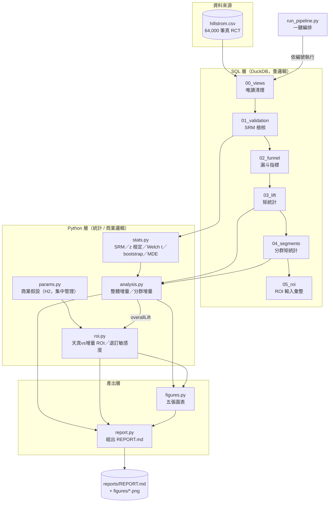

# push-campaign-roi - 系統架構

> 本文件描述 pipeline 的整體架構、資料流與模組關係。

---

## 1. 高層架構圖



## 2. 模組職責

| 模組 | 職責 | 對應規劃書 |
|------|------|-----------|
| `sql/00_views.sql` | 原始 CSV 唯讀清理、衍生 `treated` 欄 | 前置 |
| `sql/01_validation.sql` | SRM 樣本比例、共變數平衡表 | 信度關卡 |
| `sql/02_funnel.sql` | 各組漏斗指標（visitRate／convRate／RPM） | Q1 |
| `sql/03_lift.sql` | 各組矩統計，供 Python 層檢定 | Q1 |
| `sql/04_segments.sql` | 四維（recency／歷史消費／新客／渠道）分群矩統計 | Q2 |
| `sql/05_roi.sql` | ROI 計算輸入彙整 | Q1/Q3 |
| `src/stats.py` | 純統計函式：SRM 卡方、兩比例 z、Welch t、bootstrap CI、MDE | 信度基礎 |
| `src/params.py` | 商業假設集中地（毛利率／發送成本／退訂率區間／年推播檔數） | H2 |
| `src/analysis.py` | 整體增量（`overallLift`）、分群增量（`segmentLift`） | Q1/Q2 |
| `src/roi.py` | 天真 vs 增量 ROI 並列、pooledReachValue、退訂率敏感度掃描 | Q1/Q3 |
| `src/figures.py` | 五張 matplotlib 靜態圖，色票依 dataviz skill | 呈現 |
| `src/report.py` | 組出 `reports/REPORT.md`（產物，勿手改） | 交付 |
| `src/run_pipeline.py` | 一鍵編排；SRM 不過即中止，不產報告 | 全流程 |

## 3. 資料流

```
data/raw/hillstrom.csv（唯讀）
  → DuckDB view/table（00–05，依編號執行）
  → Python 讀表算增量與 ROI（analysis.py / roi.py，商業假設吃 params.py）
  → 圖表（figures.py）與 REPORT.md（report.py）同步產出
```

**關鍵防呆**：`01_validation.sql` 的 SRM 卡方 p < 0.01 → `run_pipeline.py` 立即 `sys.exit(1)`，
不產生任何報告——隨機分組失衡代表後面所有增量數字無效，寧可不出報告也不出錯報告。

## 4. 技術棧

Python 3.12 + venv；DuckDB（SQL 引擎）；pandas（輕整形）；scipy（統計檢定）；
matplotlib（靜態圖，PingFang TC 處理中文字型）；numpy（bootstrap 向量化）。
無外部服務依賴、無資料庫伺服器、無需憑證（資料來源 MineThatData 官網直載）。
